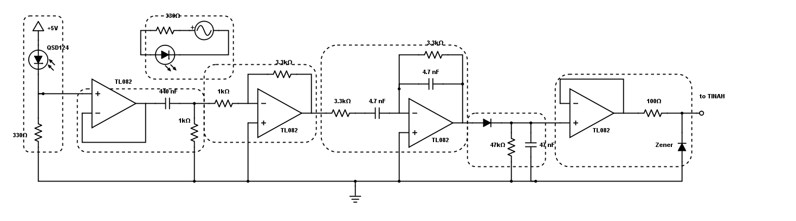

# Lab 2: Analog Circuits and Filtering

[Link to lab](http://projectlab.engphys.ubc.ca/enph253-2017/labs-lectures-2017/lab-2-2017/)

## Circuit Notes

** Counter-clockwise from Top**

**0. Variable Frequency IR Light**

IR light bulb powered by variable function generator. Resistor should be chosen based on desired current level. The 330Ω choice was good for this lab.

**1. QSD124 IR Sensor**

Resistor choice of 330Ω seemed an acceptable balance between sensitivity and responsiveness.

We initially used 10kΩ. This resulted in a signal that attenuates at higher frequencies, probably due to the reduction in responsiveness. Attenuation was still noticeable at 1kΩ. At 330Ω, we were able to get an acceptable output. No railing was observed with 15V OpAmp power.

For our final robot circuit, we may consider reducing the resistant further because of the reduction in OpAmp power from 15V to 9V.

The QSD124 has a very small field of view. Pointing even slightly away from the light source has a very large effect on the QSD124.

**2, 3. DC Block, Amplifier**

Gain is -3.3. Seems like a good ratio for now.

**4. Bandpass Filter**

Choice of 3.3kΩ resistor and 4.7 nF capacitor optimises for 10.2 kHz.

**5. Peak Detector**

Choice of 47kΩ resistor and 47 nF capacitor results in ~4.5% voltage drop off between cycles.

**6. Zener Diode Protector Circuit**

A buffer was needed to prevent the (probably low-impedance) TINAH analog inputs from messing with the output(s) of the previous circuit.

Zener diode protection info taken from [here](https://electronics.stackexchange.com/questions/35807/how-would-i-design-a-protection-clipper-circuit-for-adc-input). Choice of resistor value is arbitrary; should be higher if higher current may need to be sunk.

## Further Notes

* Double/triple check all component values!
* Our (Amar & Lise's lab bench) breadboard is terrible. Verify connections between breadboard holes in the future.

## Futher Exploration

* Determine sensor distance range. At what distance does a 10kHz signal result in an equivalent output to a 1kHz signal at, say, 2 cm?
* Try making fancy diode rectifer
* Possibly try fancy band pass filter?
* Test circuit with 9V power
