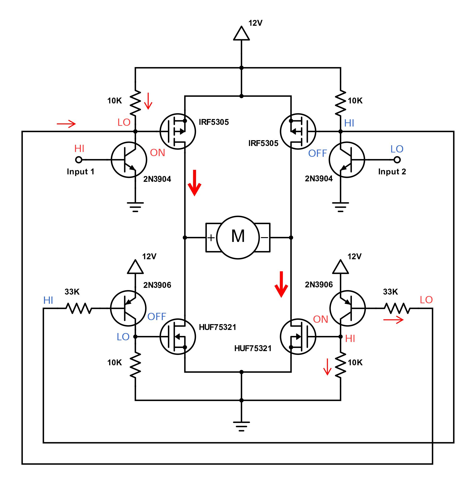
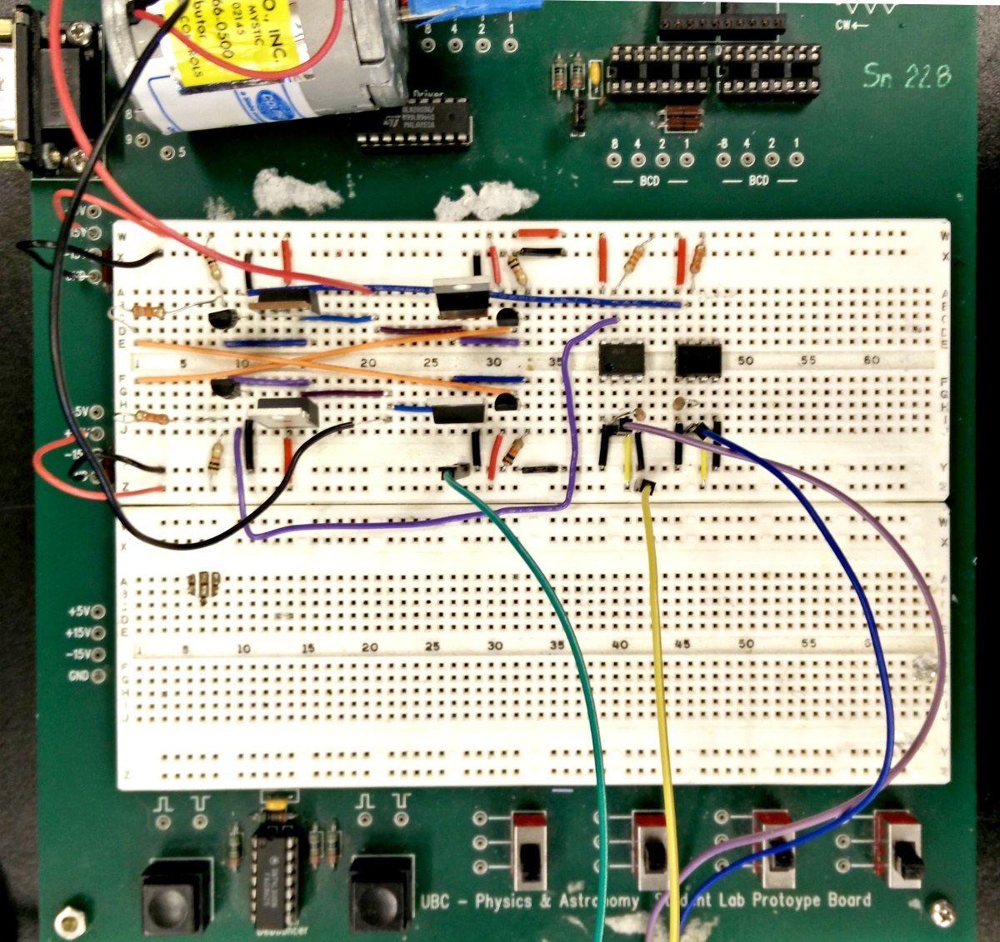

# Lab 3

## 1. Directly drive a DC motor with the TINAH

Code snippet:

```
void loop()
{
  long motorSpeed = map(knob(6), 0, 1023, -255, 255);
  LCD.setCursor(0,0);
  LCD.print(motorSpeed);
  LCD.print(" ");
  motor.speed(0, motorSpeed);
  delay(100);
}
```

### Testing amount of torque

- We used a 40g weight suspended 2.5 cm from motor shaft on a wheel of radius 3 cm, mass 15g
    - Neglecting the moment of inertia of the wheel, a torque of tau = rmg = (0.025 m)(0.04 kg)(9.81 N/kg), so roughly 0.01 Nm, is needed to get the weight past 90 degrees
- Motor was able to turn with some struggle
- This implies that the output is greater than 0.01 Nm of torque but probably not by much

## 2. Drive a servo motor

Code snippet:

```
void loop()
{
  long servoPosition = map(knob(6), 0, 1023, 0, 180);
  RCServo0.write(servoPosition); 
  LCD.setCursor(0,0);
  LCD.print(motorSpeed);
  LCD.print(" ");
  delay(100);
}
```

## 3. Check motor output waveform with and without 10k resistors


Key takeaway: might want resistors at TINAH motor outputs, for better responsiveness?

## 4. H-bridge



We did very well on this. Minimal troubleshooting was needed. Tactics:

- kept things neat and colour coded (including different colours for each motor spin direction
- test each component as we put it in, before adding others



Video link: https://youtu.be/VE9Rnmx8OYA

## 5. Motor noise

Adding decoupling capacitors across rails (470 μF x3) helped smooth the noise a lot.

Noise appeared to worsen after adding a 10 nF capacitor across the motor lines.

Switching to a different motor with twisted wires -- made no or almost no difference.

The noise appeared to worse when running at low PWM levels. Beyond 100 or -100, it improved.

## 6. Alternataive H-bridge

This was incredibly easy to build. There is merit to using easy-to-build components.

However, there was noticeable drop off in motor torque at power levels below ~13V. This was especially noticeable at high PWM ranges.

Conclusion: probably best to stick with H-bridge #1.
